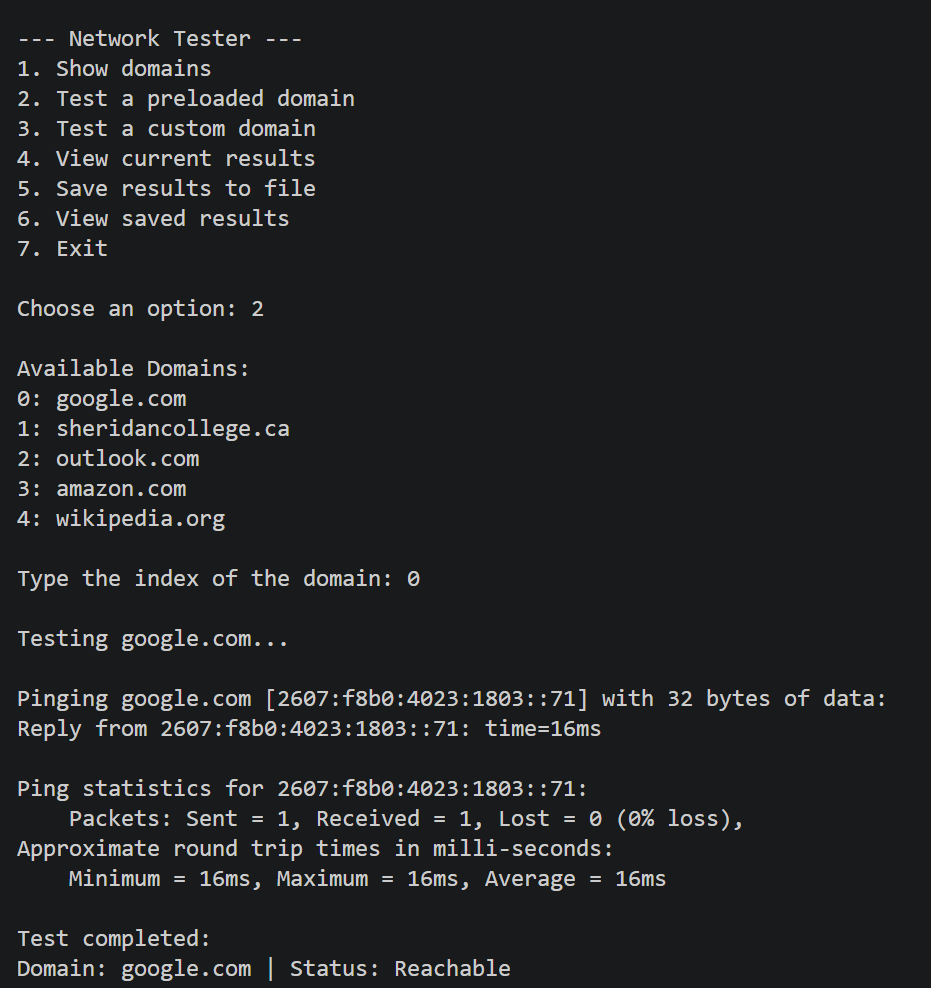

# Python Network Tester

A command-line Python application that automates basic network
reachability testing while applying foundational Python programming
concepts.



## The Problem

While learning Python in my first semester, I wanted to move beyond
practicing individual programming concepts in isolation and combine them
into one working application.

I chose basic network connectivity testing as the problem to solve
because it provided a simple way to interact with operating-system
commands while practicing Python program structure.

## The Goal

The goal was to build a menu-driven command-line application that could:

-   test predefined domains
-   accept custom domains from the user
-   automatically run connectivity tests
-   store results during program execution
-   save results for later viewing

## The Solution

The finished application provides:

-   predefined domain selection
-   custom domain testing
-   automated ping execution
-   Windows and Linux/macOS ping support
-   reachable/unreachable status reporting
-   object-based result storage
-   persistent result logging
-   viewing of previously saved results
-   basic input and exception handling

## How It Works

The user selects an option from the command-line menu and chooses either
a predefined domain or enters a custom domain.

The application executes the operating system's `ping` command and uses
its return status to determine whether the destination is reachable.

Each result is represented by a `NetworkTest` object. Results can be
viewed during the current session or written to a local file for later
review.

## Demonstration

The screenshot below shows the command-line application running a
network reachability test.


## Concepts Applied

This project applies concepts from my Semester 1 Python coursework,
including:

-   functions
-   classes and objects
-   lists
-   loops
-   conditional logic
-   exception handling
-   user input
-   file reading and writing
-   Python modules
-   basic program organization

## Technologies Used

-   Python 3
-   Python `os` module
-   system `ping` utility
-   command-line interface

## What I Learned

This project helped me move from practicing individual Python concepts
to combining them inside a complete program.

I gained experience organizing application logic with functions and
classes, working with user input, handling errors, reading and writing
files, and interacting with operating-system commands from Python.

It also introduced me to using programming as a way to automate simple
system and network-related tasks.

## Future Improvements

The original project intentionally remained relatively simple. Possible
improvements include:

-   stronger domain and user-input validation
-   timestamps for test results
-   latency measurement
-   improved process execution
-   structured result logging
-   additional diagnostics such as traceroute

## Repository Structure

``` text
python-network-tester/
├── README.md
├── Auto-NetworkTester.py
├── .gitignore
└── screenshots/
    └── network-tester-demo.png
```

## Learning Approach

This project was developed using concepts learned during my Semester 1
Python course.

Rather than following a complete project tutorial, I used the
programming concepts I was learning to build a small practical
application and understand how those concepts could work together.

## Author

**Sharoon Emmanuel**\
Software Development & Network Engineering Student
